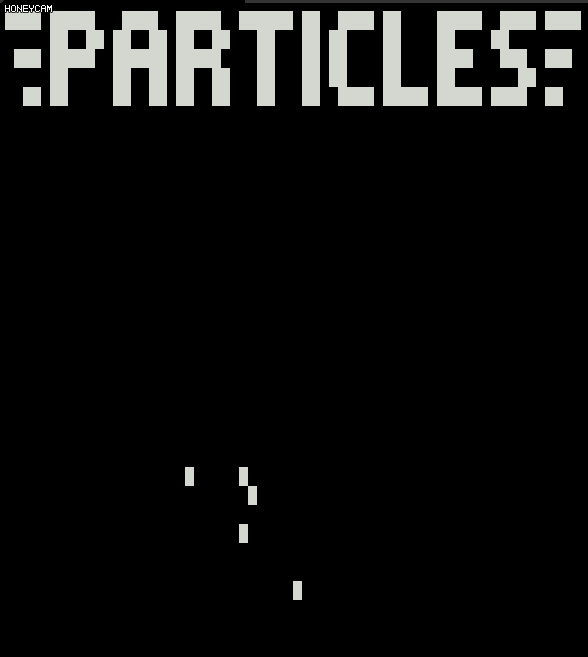

# chipmunk

[CHIP-8](https://en.wikipedia.org/wiki/CHIP-8) interpreter simulator toy project written in [Rust-lang](https://en.wikipedia.org/wiki/Rust_(programming_language)).

## Getting Started

This project only exports executable application, so just build with cargo.

``` bash
cargo build
cargo build --release
```

To execute built application, write valid CHIP-8 supported file path into next command like below.

``` bash
./chipmunk "./roms/demos/Maze [David Winter, 199x].ch8"
```

This project does not include CHIP-8 program pack, get distributed CHIP-8 packs into [this link](https://github.com/dmatlack/chip8/tree/master/roms).

## Samples


``` bash
./chipmunk Sirpinski [Sergey Naydenov, 2010].ch8
```



``` bash
./chipmunk Particle Demo [zeroZshadow, 2008].ch8
```

## License

This project is licensed under GPL 3.0 license.

see the [LICENSE](LICENSE) file.

## Acknowledgments

* [Awesome CHIP-8](https://chip-8.github.io/links/)

* [CHIP-8 Program Packs](https://github.com/dmatlack/chip8/tree/master/roms)